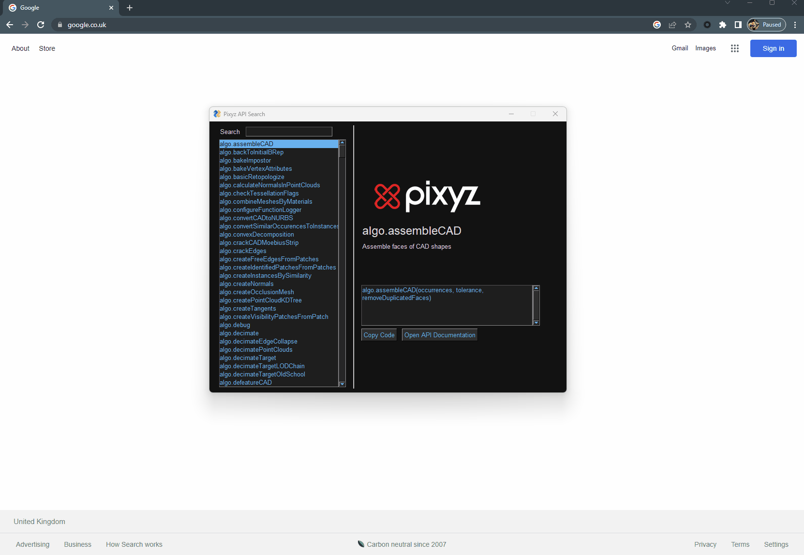
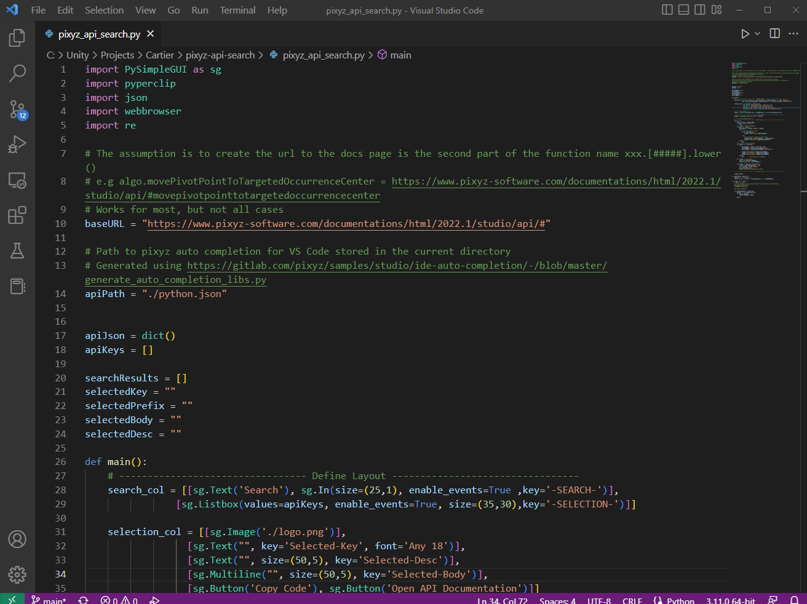

# pixyz-api-search

A simple python gui for browsing pixyz api offline


# Installation

Requires python 3 to run
https://www.python.org/downloads/

### Run.bat

Simply execute `Run.bat` to launch the script and install the required dependencies.

### Source Code

In order to run from the source, you will need to install 2 python dependencies
```
pip install pysimplegui
pip install pyperclip
```
Then simply open `pixyz_api_search.py` in VS Code and select `Run > Run Without Debugging`



