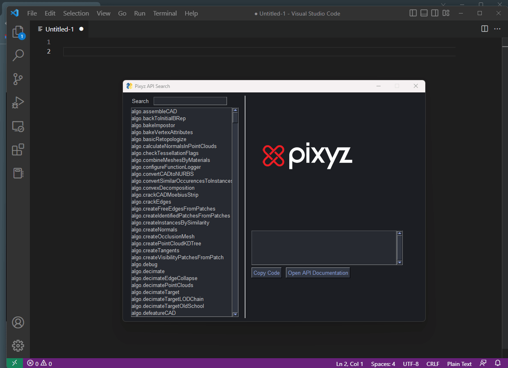

# pixyz-api-search

A simple python gui for browsing pixyz api offline


# Installation

In order to run from the source, you will need to install 2 python dependencies
```
pip install pysimplegui
pip install pyperclip
```
Then simply open `pixyz_api_search.py` in VS Code and select `Run > Run Without Debugging`


